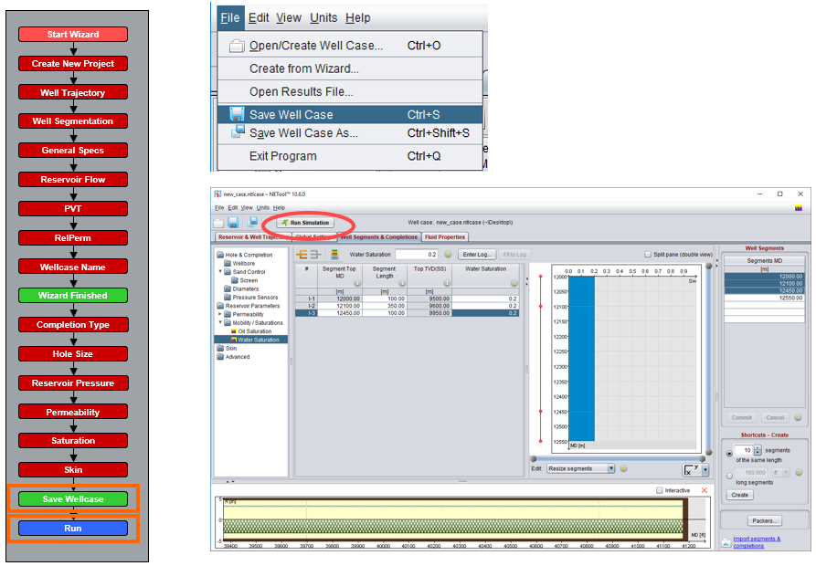

# Exercises

## “My first well”

Import Reservoir Model. 

* Choose File -&gt; Open/Create Well case
* Switch to the “Open/Create Well Case” page
* Press “Add Reservoir model”

Select input data format

* Select ”Import reservoir model in Eclipse format”
* Push ”Next &gt;”

Import files

* Browse to find the Eclipse INIT file 
* Select the file ’long horizontal.INIT’  
* Push ”Next &gt;” 
* NETool lists all Eclipse files with the same name. 
* Push ”Next &gt;” twice

* Select all timesteps
* Push ”Next &gt;”
* Set the name of Imported Reservoir Model 
* Press ‘Finish’

* Choose ‘Create a new well case’ 
* Press OK

* Go to Reservoir & Well Trajectory tab 
* Click several points on the upper reservoir view

* Select ‘Global Settings’ tab at the top of main window. 
* Choose ‘Well Target & IPR’ folder in Global Settings. 
* Set Bottomhole pressure = 100 bar, and choose ‘BHP defined at bottomhole MD’.

! Please note that for MD = 0, TVD ≠ 0, that’s why bottomhole point here. Netool allows modelling of the entire well: simply change the well survey with TVD at the depth of the wellhead \(MD = 0\).

* Go to ‘Well Segment & Completion’ tab 
* ‘Drill’ the well creating 10 segments of the same length 
* Press ‘Create’

* Press “Run Simulation” button

* Interpret Results

## Build Case from Scratch with a “Wizard”

Well Description:

* See figure below
* Vertical Producer 
* Screens completion 
* Oil Flowrate Target = 3000 stb/day 
* 2 geological zones with different permeabilities 
* Initially 80% oil saturation 
* RelPerm – Wyllie’s correlations for cemented sandstone 
* PVT - Undersaturated oil and water 
* Reservoir Flow Modeling 
  * Steady-State 
  * Drainage radius = 2000 ft 
  * Supplied reservoir pressure = Average reservoir pressure 
  * Add hydrostatic correction to entered reservoir pressure

Follow the instructions.

### Get Started with Netool Wizard

Click File -&gt; Create from Wizard...

### Create New Project

### Well Trajectory

* Enter coordinates for Top and Bottom 
* Enter Measured depth of Heel 
* Click “Commit” button

### Well Segmentation

* Switch to Well Segments & Completion tab on the top of main NETool window 
* Enter four ‘Segments MD’ values to define segment boundaries for 3 segments 
* Click “Commit” button

### General Specs

* Choose Well type Producer 
* Select phases Oil and Water

### Well Target and IPR

* Open Global Settings Select “Well Target & IPR” folder 
* Choose “Single target” 
* Define production well target: Oil Flowrate = 3000 stb/d

### Reservoir Flow

* Set Reservoir Pressure = Hydrostatics from bottomhole MD 
* Set Reservoir Pressure Value = 5000 psi 
* Choose Radial inflow model and Steady Radial PI Model type 
* Choose Average pressure in drainage area mode

### PVT Properties

* Accept default values and choose Oil PVT tab 
* Enter constant solution gas-oil ratio \(Rs\) of 100 SCF/STB 
* Define oil phase formation volume factor \(Bo\), viscosity as function of pressure

### Relative Permeabilities and Well Case Name

* Choose Wyllie’s consolidated sandstone correlation for RelPerm modelling
* Save the wellcase by giving it a name

Wizard is finished !! 

Further defintion of reservoir properties and completion parts is performed in the Well Segment Settings & Completions panel. It is also possible to return to previous menus to revise supplied data.

### Hole & Completion

* Select Well Segments & Completions panel 
* Choose folder Hole & Completion
* In column Sand Control select “Screen“ for all segments
* Choose folder Diameters 
* Define the Wellbore Diameter = 9 in column Wellbore Diameter\*

\*Differs from well schematic diagram

### 

### Permeability

* Choose folder Reservoir Parameters 
* Choose folder Permeability 
* In column Kh define permeability for segments 1, 2 = 200 mD and segment 3 = 1000 mD

### Saturation and Skin

* Choose folder Saturations \(Reservoir Parameters-&gt;Mobility/Saturations-&gt; Water Saturation\) 
* In column Water Saturation define value = 0.2 for all segments. This calculate the Oil Saturation column to be 0.8 
* The reservoir doesn’t have damage, so, in Skin panel, leave checkbox Near Wellbore Damage unselected for all segments. Set Additional Skin for all segments as 0.

### 

### Save Well Case and Run

* Perform File -&gt; Save Well Case Click 
* Run Simulation button

### Get Started with Netool Simulation Results

* Inspect Results 
* Look at Summary Table 
* Look at the plots and customize 
* Analyse Detailed Plots of different parameters to understand performance

## Well target, IPR and Well Performance Curve

